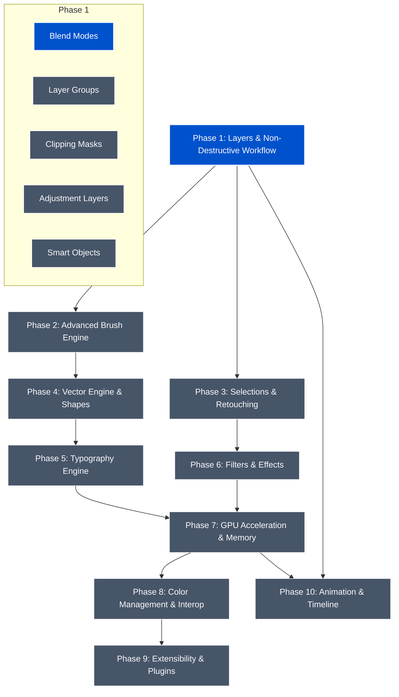

# Sienna: Product Roadmap & Architectural Blueprint

This document outlines the comprehensive, multi-phase roadmap to evolve Sienna from a basic tiled GPUI canvas into a professional, production-ready alternative to industry-standard graphic design suites (Photoshop, Affinity, GIMP).

---

## 🗺️ Visual Architecture & Phase Dependencies

---

## 🚀 Roadmap Phases

### Phase 1: Layers & Non-Destructive Workflow
Establish the core compositing engine and structural features required for complex digital editing.
*   **Layer Blend Modes:** Support for 10 standard blending equations (Multiply, Screen, Overlay, etc.) decoupled from rendering.
*   **Layer Groups:** Hierarchical folders with folder-level opacity, visibility, and "Pass Through" blending.
*   **Layer Clipping Masks:** Clip a layer's visibility to the alpha boundary of the layer directly beneath it.
*   **Non-Destructive Layer Masks:** Grayscale pixel masks for raster layers and vector path masks.
*   **Adjustment Layers:** Special non-destructive layers containing HSL, Levels, Curves, Exposure, and Photo Filters.
*   **Smart Objects & Smart Filters:** Nesting reference documents or vectors that can be scaled non-destructively, supporting filter stacks.

### Phase 2: Drawing & Painting (Advanced Brush Engine)
Build a industry-competitive brush engine tailored for digital artists.
*   **Brush Dynamics:** Input mapping for pen pressure, tilt, velocity, and direction.
*   **Dynamic Scattering & Jitter:** Randomize brush size, angle, opacity, and positioning along the stroke.
*   **Wet Mix & Mixer Brushes:** Support for color mixing, paint loading, wetness, and blending on the active layer.
*   **Custom Brush Textures:** Mask brush tips with custom grayscale textures for canvas tooth effects.
*   **Brush Stabilization:** Add "Lazy Mouse" and exponential smoothing algorithms.
*   **Preset Management:** A panel to save, tag, and export custom brush presets.

### Phase 3: Selections & Retouching
Provide fine-grained control over raster manipulation and selection masks.
*   **Selection Engine:** Store active selections as 8-bit grayscale channels (supporting soft edges and feathering).
*   **Selection Tools:** Rectangular/Elliptical marquee, Lasso, Polygon Lasso, and Magic Wand (with tolerance settings).
*   **Transformation Workspace:** Scale, rotate, skew, perspective warp, and liquify.
*   **Retouching Tools:** Clone Stamp, Healing Brush, Patch Tool, and Content-Aware Fill.

### Phase 4: Vector Engine & Shapes
Implement a vector math engine comparable to Illustrator or Affinity Designer.
*   **Bézier Path Geometry:** Core mathematical library for cubic and quadratic Bézier curve manipulation.
*   **Pen & Node Tools:** Edit curves, add/remove anchor points, and convert points (smooth, sharp, symmetric).
*   **Parametric Shape Tools:** Rectangles, Ellipses, Polygons, and custom shapes with non-destructive corner rounding.
*   **Boolean Path Operations:** Combine shape geometries via Union, Subtract, Intersect, and Exclude.
*   **Vector Styling:** Stroke alignment (inside, center, outside), dash patterns, and linear/radial gradient fills.

### Phase 5: Typography Engine
Unlock professional text layout and typography.
*   **Text Layers:** Add a dedicated vector-based text layer type.
*   **Paragraph Layout:** Paragraph styling, text boxes, rich text markup, and character properties (Font, Size, Tracking, Kerning, Leading).
*   **Text-on-a-Path:** Allow text to flow dynamically along any vector Bézier path.

### Phase 6: Filters & Effects Engine
Provide a comprehensive filter library.
*   **Standard Filter Library:** Gaussian blur, motion blur, radial blur, sharpen, noise, pixelate, and custom convolutions.
*   **Liquify Workspace:** Dedicated viewport for non-destructive mesh warping (push, bloat, pucker, twirl).
*   **Layer Styles/Effects:** Add non-destructive styles (drop shadow, outer glow, stroke, color overlay) on layers.

### Phase 7: GPU Acceleration & Memory Management
Ensure Sienna can scale to high-resolution, multi-gigabyte documents (4K/8K, 100+ layers) with real-time feedback.
*   **GPU Compute Compositing:** Port the decoupled blend/compositing engine to GPU compute shaders (e.g. `wgpu` or platform-native graphics).
*   **Sparse Tile Paging:** Virtual memory system that swaps inactive tile pixel buffers to disk/cache to prevent RAM saturation on massive documents.
*   **Multi-Threaded Rendering:** Pipeline utilizing GPUI's async runtime to execute brush dynamics, filter previews, and exports concurrently.
*   **Interactive Viewport Controls:** Real-time canvas rotation, mirroring, zooming, and canvas rulers/guides/snapping.

### Phase 8: Color Management & Professional Interoperability
Ensure Sienna fits cleanly into existing design pipelines.
*   **Color Space Management:** Color profiles (sRGB, Adobe RGB, Display P3), ICC profile mapping, and native CMYK support for print.
*   **PSD Parser/Writer:** Native import and export capabilities for Adobe Photoshop (.psd) files, preserving layer structure, masks, and blend modes.
*   **Batch Exporter:** Exporter panel for slicing and batch exporting assets to multiple web/print formats (PNG, JPEG, WebP, SVG, PDF).

### Phase 9: Extensibility & Plug-in Ecosystem
Allow the community to extend Sienna with scripting and binaries.
*   **Wasm Plugin SDK:** Safe, high-performance plugin sandbox using WebAssembly, allowing developers to build custom filters, tools, and UI panels.
*   **Scripting Bindings:** Expose Sienna's document model to a scripting language (e.g., Python, JavaScript, or Lua) for automation.

### Phase 10: Animation & Timeline (Motion Graphics)
Support dynamic frame-by-frame and keyframed motion design workflows.
*   **Keyframe Timeline:** Timeline panel enabling users to keyframe layer transforms (Position, Rotation, Scale), opacity, and adjustment layer parameters.
*   **Frame-by-Frame Animation:** Onion skinning, frame duplication, playback controls, and frame rate (FPS) settings for cell animation.
*   **Motion Rendering:** Video export (MP4, WebM) and animated image export (GIF, APNG).

---

## 📊 Milestone Tracking

| Milestone | Phase | Priority | Target Outcome | Status |
| :--- | :--- | :--- | :--- | :--- |
| **Compositing & Blending** | Phase 1 | 🔥 Critical | Standard blend modes, layer opacity, and decoupled compositor. | **Active** (Mapped) |
| **Adjustment & Groups** | Phase 1 | High | Group folders, adjustment layers (HSL, Curves). | Planned |
| **Brush Dynamics & Pen Pressure** | Phase 2 | High | Support pen pressure and tilt with dynamic jitter. | Planned |
| **Pen Tool & Vectors** | Phase 4 | High | Anchor point drawing, boolean path operations. | Planned |
| **Selections Workspace** | Phase 3 | Medium | Selection masks, Lasso, Magic Wand. | Planned |
| **GPU Compute Shader Engine** | Phase 7 | High | 60 FPS viewport rendering on 8K canvases. | Planned |
| **PSD File Support** | Phase 8 | Low | Seamless import/export with Photoshop. | Planned |
| **Animation Timeline** | Phase 10 | Low | Keyframing panel, onion skinning, GIF/video exports. | Planned |
| **Wasm Plugin SDK** | Phase 9 | Low | WebAssembly API for custom tools and filters. | Planned |
